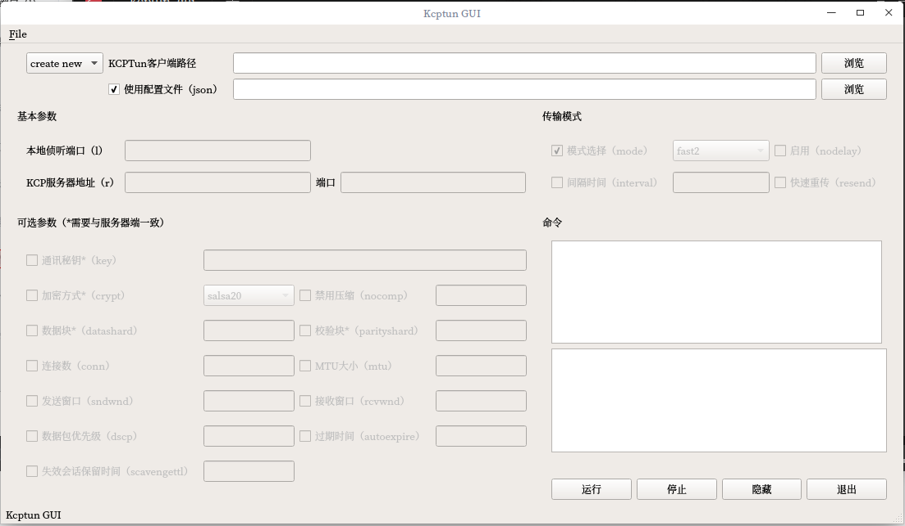

# 使用PyQt5创建一个kcptun的GUI

第一次学习使用PyQt5，只有三个文档可以参考

 - [http://zetcode.com/gui/pyqt5/](http://zetcode.com/gui/pyqt5/)
 - [https://pythonspot.com/en/pyqt5/](https://pythonspot.com/en/pyqt5/)
 - [https://www.gitbook.com/book/maicss/pyqt5/details](https://www.gitbook.com/book/maicss/pyqt5/details)

GUI布局和功能上参考了[https://github.com/dfdragon/kcptun_gclient](https://github.com/dfdragon/kcptun_gclient)

由于第一次折腾PyQt5，代码写的呵呵

### 界面 v1.0

##### 目前实现了如下功能（最基本的功能）：
1. 通过复选框选择使用哪些参数
2. 命令的文本框展示最终运行的命令
3. 最右下角的文本框事实反馈命令的运行情况
4. 浏览按钮选择各种文件
5. 参数提交一次就能够记录，下次打开自动填写
6. 隐藏到系统托盘，托盘图标双击浮现

##### 问题
- 只能记录正在使用的这套配置
- 无法启动自隐藏
- 无法启动自运行
- win10貌似托盘里不显示图标，虽然它占了一个位置

##### 未来打算添加
- 左上的create new，打算做成一个选择框，记录和选择多个不同服务器的配置信息
- 有几个参数使用频率不高，打算直接去掉
- 菜单栏需要继续完善，添加是否启动自隐藏、启动自运行等等选项

**由于这个就是练手，个人需求不大，所以，随时准备鸽；下一个GUI的话可能就是学习折腾一个PyQt的字典来用了，毕竟有道跪了，感觉还是不爽**