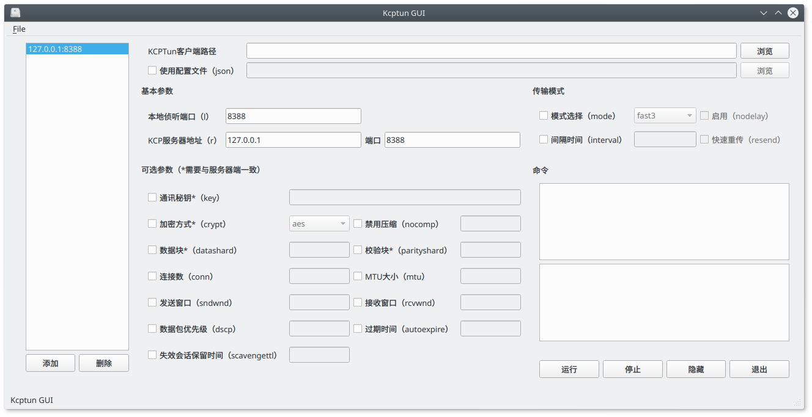

# 使用PyQt5创建一个kcptun的GUI

第一次学习使用PyQt5，只有三个文档可以参考

 - [http://zetcode.com/gui/pyqt5/](http://zetcode.com/gui/pyqt5/)
 - [https://pythonspot.com/en/pyqt5/](https://pythonspot.com/en/pyqt5/)
 - [https://www.gitbook.com/book/maicss/pyqt5/details](https://www.gitbook.com/book/maicss/pyqt5/details)

GUI布局和功能上参考了[https://github.com/dfdragon/kcptun_gclient](https://github.com/dfdragon/kcptun_gclient)

由于第一次折腾PyQt5，代码写的呵呵

### 界面 v1.0


### 界面 V1.1


##### 目前实现了如下功能（最基本的功能）：
1. 通过复选框选择使用哪些参数
2. 命令的文本框展示最终运行的命令
3. 最右下角的文本框事实反馈命令的运行情况
4. 浏览按钮选择各种文件
5. 参数提交一次就能够记录，下次打开自动填写
6. 隐藏到系统托盘，托盘图标双击浮现
7. 添加和切换不同的配置

##### 问题
- 无法启动自隐藏
- 无法启动自运行
- KDE貌似托盘里不显示图标，虽然它确实存在而且功能正常

##### 未来打算添加
- 菜单栏需要继续完善，添加是否启动自隐藏、启动自运行等等选项
- 短时间内不打算继续学PyQt了，因此可能就此搁置了吧

##### 编译版本
- icon文件通过.qrc和pyrcc5转化成py文件来使用了，应该不存在图标的问题
- 使用pyinstaller编译了一个Linux x64和一个win10，自己试了一下貌似可用，没多测试


##### Pyinstaller打包
```bash
# -F：打包为单文件；-w：不使用单独的console；--icon：添加icon
pyinstaller -F -w --icon=./icon/k.ico main.py
```